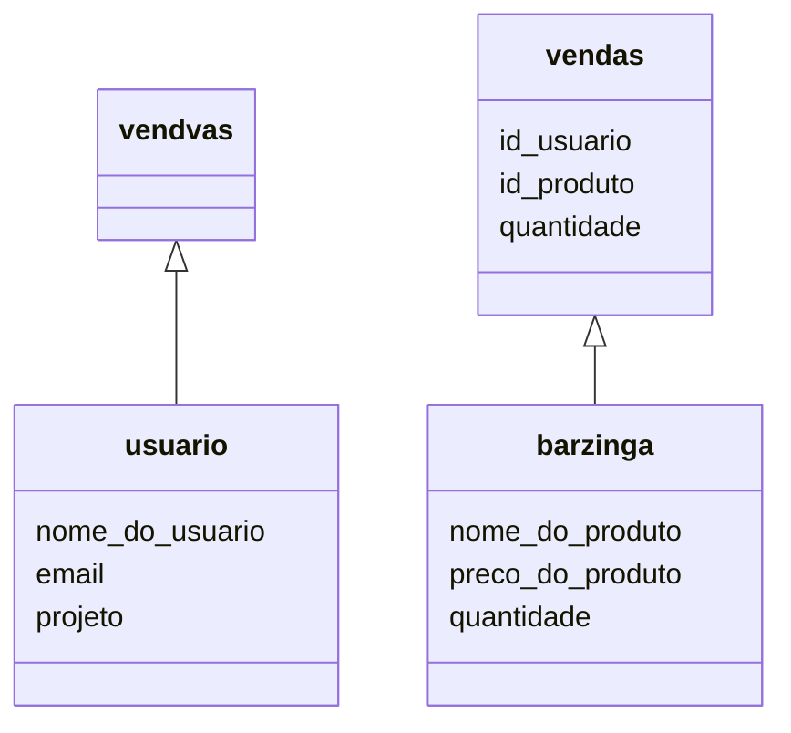

[](https://gitpod.io/#https://github.com/fabiosv/dojo-sql)

# Treinamento de SQL Xtags Dextra

## Create Mysql environment

```sh
docker run -d -p 3306:3306 -P -e MYSQL_ROOT_PASSWORD=admin --name mysql-dojo mysql:5.7
```

Este código é o protótipo de criação do banco de dados do Barzinga (self-service de doces da Dextra). Nesse projeto o nosso objetivo é criar duas tabelas, uma paa usuários e outra para a loja.

```sh
Tabela usuários:
├──Nome
├──Email
└──Projeto

Tabela barzinga:
├──Nome
├──Preço
└──Quantidade

Vendas:
├──ID_Usuario
├──ID_Produto
└──Quantidade
```
> *Observação, a coluna Email ainda não foi criada*

Seguindo o DER:


## Vamos começar
1 - Entre no arquivo `config/config.json` e troque o parametro `database` do ambiente **development** para `<nome>_<sobrenome>`. Ex: `fabio_valonga`. \
2 - Rodar comando `npm run sequelize-migrate`. \
3 - Rodar comando para criar modelo de **barzinga** e **vendas**. (dica: leia a sessão [Gerando Model](/#Model)). \
4 - Rodar comando `npm run sequelize-migrate`. \
5 - Rodar comando `npx sequelize-cli db:seed:all` para popular o banco. \
6 - Adicionar a coluna **email** ao modelo **usuario** (crie uma nova migration). \
7 - Edite o modelo `Usuarios`, adicionando a coluna `email`. \
8 - Adicionar uma consulta no método `./index.js:main()` selecionando todas as compras da `Stella Louise`.


## Criação de Arquivos:

### Gerando Model
Para criar um novo modelo, use o comando abaixo **como referência**:
```sh
npx sequelize-cli model:generate --name usuario --attributes nome:string,projeto:string
```

Esse comando de criar o modelo irá criar tambem a migration pra tabela com os atributos informados.

### Gerando Migration
Para criar uma migration execute:
```sh
npx sequelize-cli migration:generate --name $NOME_DA_MIGRATION
```

### Criando Seed
Para criar uma migration execute:
```sh
npx sequelize-cli seed:generate
```
